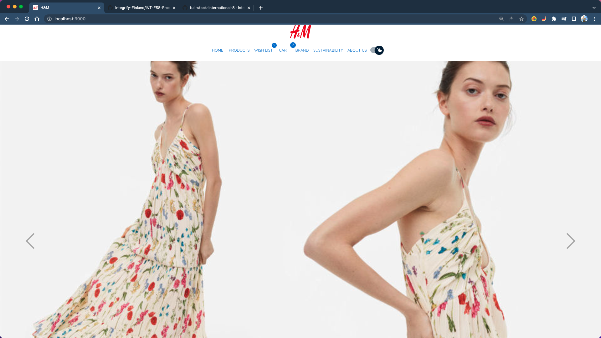
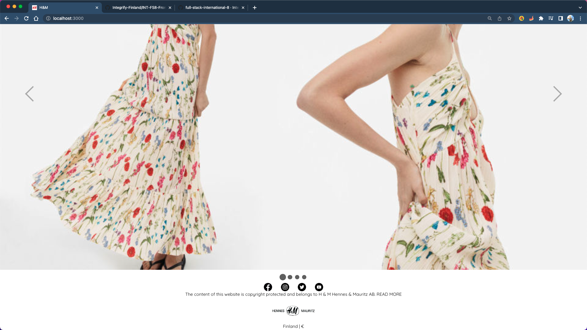
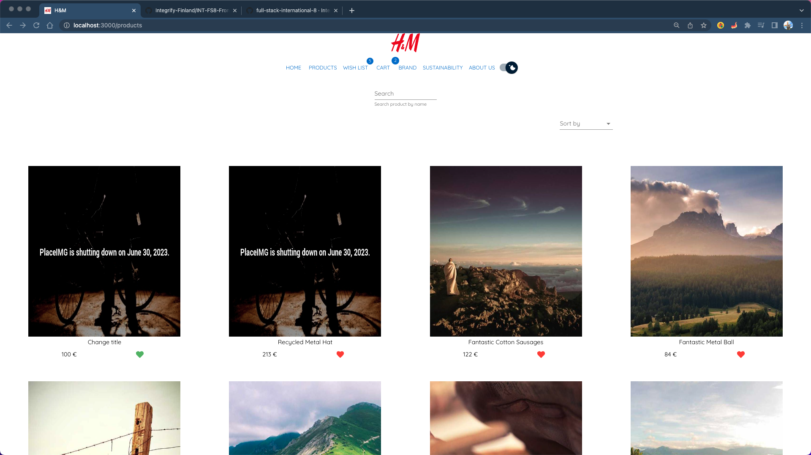
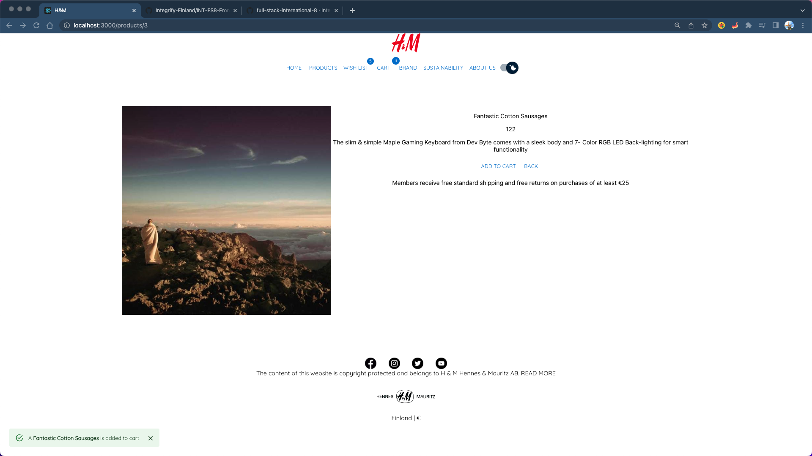
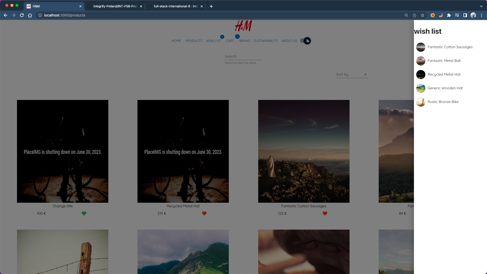
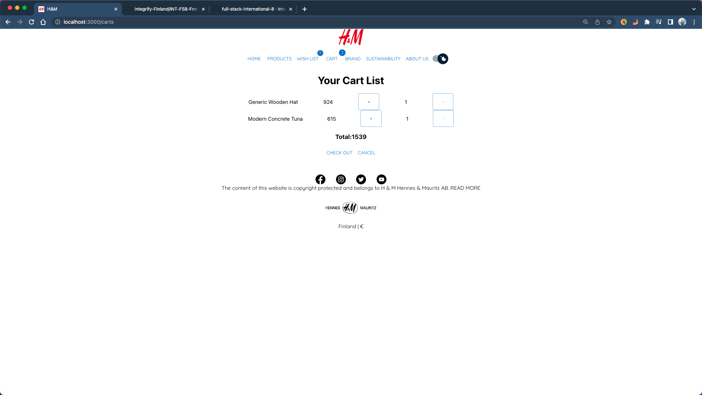

# FRONT END PROJECT

The front end project uses React with TypeScript and Redux. Completing all requirement, you will get 20 points. Good luck and HAVE FUN !!!

### How to run project

1. Step 1: yarn
2. Step 2: yarn start

### Logic Requirements (8 points)

1. Fetch data from this API: `https://api.escuelajs.co/api/v1/products`
2. The user can search product by name
3. Get the product detail by this API: `https://api.escuelajs.co/api/v1/products/name`
4. When the user click to product image or a button it should show product detail
5. The user can add product to Favorite page
6. When the user add a product to Favorite the favorite icon should change the color.
7. Have a Loading page while fetching data
8. Deploy the project

### Styling Requirements (4 points)

1. Font: font-family: 'Nunito', sans-serif
2. Navbar and Footer
3. When the user add an product to Favorite page, you should show a message, for example: A product(or product name) just added to the favorite page

### Code style Requirements (6 points)

1. Naming convention
2. Clear file structure
3. Divided the project to small components
4. Clean code: no console.log, no dead code,
5. Format code (Prettier - Code formatter)
6. Separate import from your own file and the import from the package

### Extra requirements (2 points)

ONLY DO THIS PART WHEN YOU HAVE COMPLETED THE REQUIREMENTS PART

1. Sorting by product name/price
2. Change theme

### Screenshots

1. Home page
   

2. Footer

3. Product list
   

4. Product detail
   

5. Wish list
   

6. Cart
   
